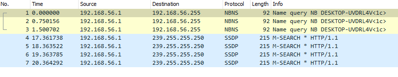
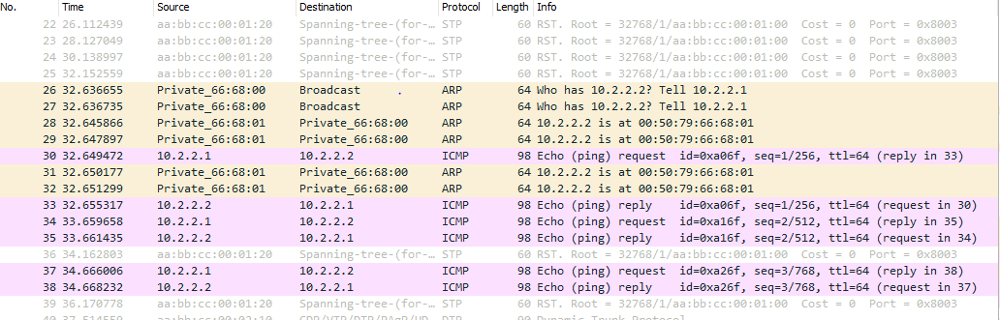

# Six-reseau-TP2

## Partie 1
* 🌞Faire communiquer les deux PCs
avec un ping et déterminer le protocole utilisé par ping à l'aide de Wireshark
```
PC1> ping 10.2.1.2
84 bytes from 10.2.1.2 icmp_seq=1 ttl=64 time=1.803 ms    
PC2> ping 10.2.1.1
84 bytes from 10.2.1.1 icmp_seq=1 ttl=64 time=3.699 ms
```


* 🌞 récapituler toutes les étapes

## Partie 2

```
PC1> ping 10.2.2.2
84 bytes from 10.2.2.2 icmp_seq=1 ttl=64 time=28.365 ms

PC1> ping 10.2.2.3
84 bytes from 10.2.2.3 icmp_seq=1 ttl=64 time=4.049 ms


PC2> ping 10.2.2.1
84 bytes from 10.2.2.1 icmp_seq=1 ttl=64 time=4.886 ms

PC2> ping 10.2.2.3
84 bytes from 10.2.2.3 icmp_seq=1 ttl=64 time=5.147 ms

PC3> ping 10.2.2.1
84 bytes from 10.2.2.1 icmp_seq=1 ttl=64 time=11.604 ms

PC3> ping 10.2.2.2
84 bytes from 10.2.2.2 icmp_seq=1 ttl=64 time=13.924 ms
```
* 🌞 analyser la table MAC d'un switch
```
IOU1#show mac address-table
          Mac Address Table
-------------------------------------------
Vlan    Mac Address       Type        Ports
----    -----------       --------    -----
   1    0050.7966.6800    DYNAMIC     Et0/1
   1    0050.7966.6801    DYNAMIC     Et0/0
   1    aabb.cc00.0210    DYNAMIC     Et0/1
Total Mac Addresses for this criterion: 3
```
Table MAC de switch1 aprés le ping entre pc1 et pc3  
1ere ligne --> adresse MAC de pc3  
2eme ligne --> adresse MAC de pc1  
1ere ligne --> adresse MAC de switch 2  

Probleme pour ping mes PCs:  
screen depuis pc1
```
...
queue is full
queue is full
10.2.2.2 icmp_seq=2 timeout
10.2.2.2 icmp_seq=3 timeout

PC1> ping 10.2.2.2
84 bytes from 10.2.2.2 icmp_seq=1 ttl=64 time=1.207 ms
10.2.2.2 icmp_seq=2 timeout
10.2.2.2 icmp_seq=3 timeout
10.2.2.2 icmp_seq=4 timeout

PC1> ping 10.2.2.3
10.2.2.3 icmp_seq=1 timeout
```

* 🐙 en lançant Wireshark sur les liens des switches, il y a des trames CDP qui circulent. Quoi qu'est-ce ?



* 🌞 déterminer les informations STP
- root bridge (RB)

- election du Root Port (RP)

```
- Switch2 
Et0/1               Root FWD 100       128.2    Shr
```   
```
- switch3 
Et0/2               Root FWD 100       128.3    Shr
```  

- port en état bloquant (BLK)
```
- switch3
Et0/1               Altn BLK 100       128.2    Shr

```

- Negociation pour determiner les port en etat de forwarding (FWD)  
Tout le reste des ports est en état de forwarding

* Schema 
```
+-----------+                                                +---------------+
|  PC1      |                                                |  PC2          |
|           +-----------+                       +------------+               |
+-----------+           |                       |            +---------------+
                        |FWD                    |FWD
                      +----+                 +----+
            Route     | SW1+-----------------+ SW2|
            Bridge    |    |FWD          ROOT|    |
                      +----+                 +----+
                         |FWD                  |FWD
                         |                     |
                         |                     |
                         |                     |
                         |                     |
                         |      +----+         |
                         +------+ SW3+---------+
                            ROOT|    |BLK
                                +----+
                                  |FWD
                                  |
                                  |
                                  |
                                  |
                                  |
                                  |
                         +--------+--------+
                         |  PC3            |
                         |                 |
                         +-----------------+
```


